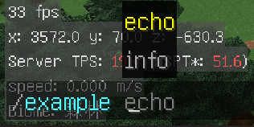
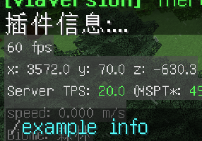
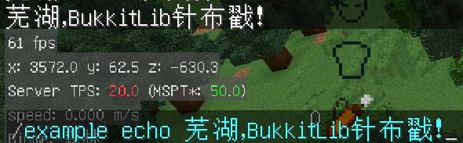

**panda -> panda-bukkit -> command**
# panda-bukkit 指令组件

`panda-bukkit` 的指令组件是其核心组件之一，提供便捷的指令注册、解析、异常处理等服务。

> 如有疑问，欢迎加入 `QQ` 群 `小明练剑场`：[1028959718](https://jq.qq.com/?_wv=1027&k=sjBXo6xh) 参与讨论和开发。

## 示例

仿照下面的代码，创建一个类专门用于处理指令：

```java
package cn.chuanwise.panda.demo.commands;

import cn.chuanwise.command.annotation.Command;
import cn.chuanwise.command.annotation.Referenceence;
import org.bukkit.command.CommandSender;

/**
 * /example info 和 /example echo [message~] 两个指令的处理器。
 * 
 * @author Chuanwise
 */
public class SimpleDemoCommands {
    
    /**
     * 向用户显示插件信息
     * 
     * @param commandSender 用户
     */
    @Command("example info")
    void displayPluginInfo(CommandSender commandSender) {
        commandSender.sendMessage("插件信息：...");
    }
    
    /**
     * 向用户回显一段非空的消息
     * 
     * @param commandSender 用户
     * @param message 非空的消息
     */
    @Command("example echo [message~]")
    void echoMessage(CommandSender commandSender,
                     @Referenceence("message") String message) {
        commandSender.sendMessage(message);
    }
}
```

这个类的方法 `displayPluginInfo` 是处理指令 `/example info` 的，`echoMessage` 是处理指令 `/example echo [message~]` 的。接下来仿照下面的代码，在插件启动时注册指令：

```java
package cn.chuanwise.mclib.example;

import cn.chuanwise.panda.bukkit.command.command;
import cn.chuanwise.panda.example.commands.SimpleDemoCommands;
import org.bukkit.plugin.java.JavaPlugin;

import java.util.Objects;

public class ExamplePlugin
        extends JavaPlugin {

    @Override
    public void onEnable() {
        // ...

        BukkitCommander.of(this)
            .bootstrap()
            .name("example")
            .aliases("e")
            .description("DemoPlugin 的所有指令")
            .object(new SimpleDemoCommands())
            .register();

        // ...
    }
}
```

打包插件并启动服务器，你将看到刚才的 `/example info` 和 `/example echo [message]` 指令已被注册，并且具备自动补全功能：



输入 `/example info`，可以看到输出信息 `插件信息：...`：



输入 `/example echo 芜湖，panda-bukkit 针布戳！`，可以看到输出信息 `芜湖，panda-bukkit针布戳！`，指令参数解析成功。



这样你就可以进行相关操作了，这真的是非常的 **AMAZING** 啊！

## 快速开始

`panda-bukkit` 可以帮你完成注册和解析指令的操作。在介绍之前，我们需要大致了解 `panda-bukkit` 的指令处理模型。

### 处理模型

一行指令，进入 `panda-bukkit` 后，将会依次经过 **分割** -> **匹配** -> **解析** -> **装配** -> **调用** 四个步骤。

#### `split` - 分割

将输入串分割为一个一个参数。

例如 `example player chuanwise send "come on" --when-player's-state="escaping for living"` 分割为 `example`、`player`、`chuanwise`、`send`、`come on`、`--when-player's-state="escaping for living"`。

#### `match` - 匹配

按照分割后的参数对照指令格式，找到匹配输入的指令，并获得变量的字面值。

例如，上面的输入可以对应 指令格式 `example player [player] send [message] [-when-player's-state]`，则相应地，变量的值分别是：

|变量名|值|备注|
|---|---|---|
|`player`|`chuanwise`||
|`message`|`come on`||
|`when-player's-state`|`escaping for living`||

#### `parse` - 解析

如果变量的参数类型不是 `String`，还需要将输入字符串进一步解析到参数类型。例如 `player` 变量的值是字符串 `"chuanwise"` 但指令处理时需要 `Player` 类型的对象，则需要进一步将它的字符串值 `chuanwise` 解析为 `Player` 类型的对象。

#### `wire` - 装配

有一些指令方法的参数不需要参数的相关信息，例如指令发送者。此时根据参数类型填充这些参数的值。

#### `invoke` - 调用

一切准备好后，调用指令方法，并捕捉异常（若有），进行后续异常处理。

其中大部分常用工作都有默认实现。我们可以通过自定义一些组件，插入自己的逻辑。

首先我们需要专门创建一个类用于指令处理，称为 `指令类`。这个类不需要继承或实现任何类型，只需要将一些特定注解打在关键方法上，就可以让方法成为特殊的组件。这些方法的类型主要有：

### 指令方法

指令方法是带有 `@Command(...)` 注解的方法。

这是实现了第一个指令 `/example info` 的指令类，方法 `displayPluginInfo` 带有 `@Command(...)` 注解，是一个 `指令方法`：

```java
package cn.chuanwise.panda.demo.commands;

import cn.chuanwise.command.annotation.Command;
import org.bukkit.command.CommandSender;

public class DemoCommands {
    // ...

    @Command("example info")
    void displayPluginInfo(CommandSender commandSender) {
        // ...
        commandSender.sendMessage("插件信息：...");
    }

    // ...
}
```

`@Command(...)` 注解只有一个参数 `String[] value()`，是指令格式字符串。下面的这些字符串都是合法的指令格式字符串：

* `example info`
* `example record [message]`
* `example [-player]`

可见指令格式字符串是由至少一个空格分隔的文本、变量和选项定义。

**文本**：非 `[` 开头的普通文本。例如 `example`、`info`。可以用 `|` 分割，例如 `info|i`，表示此处对应 `info` 和 `i` 两个文本。

**变量**：`[` 开头 `]` 结尾，却不以 `[-` 开头的一段文本。例如 `[player]`、`[message]`。其中，有以下三种值得关注的变量类型：

|变量类型|格式|示例|说明|
|---|---|---|---|
|普通变量|`[变量名]`|`[player]`、`[message]`|变量值不能带空格|
|非空剩余变量|`[变量名~]`|`[message~]`、`[alias~]`|此处及后面所有输入都将存入该变量|
|可空剩余变量|`[变量名?~]`、`[变量名?默认值~]`|`[message?~]`、`[alias?~]`、`[message?hello~]`|和非空剩余变量的区别主要在该变量可以为空，默认值不能包含 `~`|

**选项**：`[-` 和 `]` 包围的一段文本。例如 `[-time]`、`[-player]`。其可能的格式有：

|格式|示例|说明|
|---|---|---|
|`[-选项名]`|`[-player]`、`[-time\|t]`、`[-player\|user\|p\|u]`|选项名若用 `\|` 分割，则第一部分是正式名称，其余部分是别名|
|`[-选项名=可选值]`|`[-kill=true\|false]`、`[-action\|a=chat\|command\|interact]`|选项名和可选值都可以用 `\|` 分割|
|`[-选项名?默认值]`|`[-player?~]`、`[-time\|t?3h]`|默认值中若出现 `\|`，只会被当作默认值的一部分。第一个例子 `[-player?~]` 以 `~]` 结尾，不必担心，这不是变量定义，不会识别为剩余参数|
|`[-选项名=可选值?默认值]`|`[-version=1.0\|2.0?1.0]`、`[-action\|a=chat\|command\|interact\|build\|all?all]`|具体部分的格式和上述相同

**请注意**

1. 选项如果出现，只能出现在末尾。例如 `example [-time] [-player] [-action]`，而不能在选项后出现其他类型的部分。例如 `example search [-player] [-action] when [-time]`。
1. 格式字符串的第一个部分是指令名，例如 `example`，则注册后的指令是 `/example ...`。很多插件都会带有多种别名，例如 `LuckPerms` 的指令可以以 `lp` 开头，也可以以 `luckperms` 开头，这两者等价。但在写指令格式时不必都在开头写 `luckperms|lp`，这得益于默认启用的 [分支合并](#分支合并) 功能。
1. 选项的默认值也是一个可选值，例如 `[-good|g=true|false?true]` 可以简写为 `[-good|g=false?true]` ，其中 `true` 作为默认值，因此也是可选值的一部分，不重复填写也没有关系。
1. 如果选项明确规定了几个可选值，但填写的值不属于可选值，默认解析失败。可设置为接受未定义选项值。
1. 选项名和变量名都不能为空。

例如我们希望设计一款插件，包含下面四个指令：

|指令格式|作用|说明|
|---|---|---|
|`example info`|显示插件信息||
|`example record [message]`|记录一个信息||
|`example player [player] comment add [comment~]`|评论玩家|评论内容可以包含空格，**不能为空**|
|`example player [player] comment list [keys~]`|搜索玩家评论|关键词可以包含空格，**可以为空**|
|`example search-player-comment [player] [keys~]`|搜索玩家评论|上面那条指令的另一种格式|

我们只需要编写下面四个方法：

```java
// ...
import cn.chuanwise.command.annotation.Command;
import cn.chuanwise.command.annotation.Reference;
import org.bukkit.command.CommandSender;
import org.bukkit.entity.Player;

public class DemoCommands {

    @Command("example info")
    void displayPluginInfo(CommandSender commandSender) {
        // ...
    }

    @Command("example record [message]")
    void recordMessage(CommandSender commandSender) {
        // ...
    }

    @Command("example player [player] comment add [comment~]")
    void addPlayerComment(CommandSender commandSender,
                          @Reference("player") Player player,
                          @Reference("comment") String comment) {
        // ...
    }

    @Command(value = {
        "example player [player] comments list [keys~]",
        "example search-player-comment [player] [keys~]"
    })
    void searchPlayerComments(CommandSender commandSender,
                              @Reference("player") Player player,
                              @Reference("keys") String keys) {
        // ...
    }
}
```

观察上例，你会发现 `@Command(...)` 里面还可以填多个指令格式。你还会发现指令方法的参数不是固定的，接下来介绍相关参数。

指令方法的参数有两类：带和不带 `@Reference(...)` 注解的两种类型：

**自动装配**：不带 `@Reference(...)` 注解的参数是自动装配的。默认设置下，能够自动装配的类型只有 `CommandSender` 及其子类（如 `Player`），后续你会了解到自定义自动装配方式。

**引用**：带有 `@Reference(...)` 注解的参数是用于引用变量或选项的。参数写被引用的变量即可。当输入的指令匹配当前方法的格式时，将会将对应的变量解析并填入当前的参数中。

除了 `@Command(...)`，你还可以为指令方法添加用于检测权限的注解 `@Required(...)`，用于设定指令用法的注解 `@Usage(...)` 和用于设定指令功能描述的注解 `@Description(...)`。

指令用法默认是格式字符串缩写，通过 `@Usage(...)` 可以指定为其他值。

```java
// ...
import cn.chuanwise.panda.annotation.Description;
import cn.chuanwise.panda.annotation.Required;
import cn.chuanwise.panda.annotation.Usage;

public class DemoCommands {
    // ...

    @Command("example player [player] comment add [comment~]")
    @Usage("/example player <player> comment add [comment]")
    @Description("评论某个在线玩家")
    @Required("example.player.comment.add")
    void addPlayerComment(CommandSender commandSender,
                          @Reference("player") Player player,
                          @Reference("comment") String comment) {
        // ...
    }
    
    // ...
}
```

`@Required(...)` 有两个参数，除了权限参数 `String value()`，还有一个缺少权限时的权限信息参数 `String message()`，默认是空串 `""`。例如，下面的指令方法，在玩家缺少权限时向玩家发送“不会吧不会吧，你居然没有这个权限！”

```java
// ...

public class DemoCommands {
    // ...

    @Command("example player [player] comment add [comment~]")
    @Required(value = "example.player.comment.add", message = "不会吧不会吧，你居然没有这个权限！")
    void addPlayerComment(CommandSender commandSender,
                          @Reference("player") Player player,
                          @Reference("comment") String comment) {
        // ...
    }
    
    // ...
}
```

很多插件一般都有自己的消息格式，这样分散地设置权限消息并不合理。接下来介绍如何自定义缺少权限时的逻辑，以便更方便地检查权限。

### 自定义权限提示

在指令处理类中增加下面的方法，即可在玩家缺少 `@Required(...)` 内的权限时进行嘲讽：

```java
// ...

public class DemoCommands {
    // ...


    @EventHandler
    void onLackPermission(BukkitLackPermissionEvent event) {

        final CommandSender commandSender = event.getCommandSender();
        commandSender.sendMessage("你缺少权限：" + event.getPermission());
    }

    // ...
}
```

### 自定义指令执行异常提示

指令方法抛出异常时，可以通过下面的代码自定义异常提示：

```java
// ...
public class DemoCommands {
    // ...

    @EventHandler
    void onCommandExecuteError(CommandExecuteErrorEvent event) {
        final CommandSender commandSender = (CommandSender) event.getCommandSender();
        
        // to ignore the warning of 'Result of 'getCause()' not thrown'
        @SuppressWarnings("all")
        final Throwable cause = event.getCause();
        
        commandSender.sendMessage("执行指令时出现异常：" + cause);
    }

    // ...
}
```

### 自定义格式错误提示

格式错误可以分为以下几种类型：

#### 没有任何指令匹配输入

例如对于这些指令：

* `pex user [user]`
* `pex user [user] add [permission] [world?~]`
* `pex user [user] remove [permission] [world?~]`

`pex user chuanwise add` 不是一个合法的输入，此时用户最有可能希望输入下面这两条指令：

* `pex user [user] add [permission]`
* `pex user [user] remove [permission]`

此时提示这两条指令格式比只显示「指令格式错误」更友好。

```java
// ...
public class DemoCommands {
    // ...

    @EventHandler
    void onMismatchedFormat(MismatchedFormatEvent event) {
        final CommandSender commandSender = (CommandSender) event.getCommandSender();
        
        final List<String> subCommandsUsages = event.getCommandTreeForks()
            .stream()
            .map(CommandTreeFork::getCommandTreeNode)
            .flatMap(x -> x.getSubCommands().stream())
            .map(x -> x.getProperty(Properties.USAGE, x.getFormat()))
            .collect(Collectors.toList());
        
        commandSender.sendMessage("你是希望执行这些指令吗？\n" + Collections.toString(subCommandsUsages, x -> "- /" + x,"\n"));
    }

    // ...
}
```

#### 有多条指令匹配输入

```java
// ...
public class DemoCommands {
    // ...

    @EventHandler
    void onMultipleCommandsMatched(MultipleCommandsMatchedEvent event) {
        final CommandSender commandSender = (CommandSender) event.getCommandSender();
    
        final List<String> commandsUsages = event.getCommandTreeForks()
            .stream()
            .map(CommandTreeFork::getCommandTreeNode)
            .flatMap(x -> x.getSubCommands().stream())
            .map(x -> x.getProperty(Properties.USAGE, x.getFormat()))
            .collect(Collectors.toList());
    
        commandSender.sendMessage("你的输入同时匹配这些指令：\n" + Collections.toString(commandsUsages, x -> "- /" + x,"\n"));
    }

    // ...
}
```

#### 缺少必须的选项

例如指令格式 `example options [-a] [-b]`，输入 `example options --a=xxx`，并没有设置选项 `b` 的值。

```java
// ...
public class DemoCommands {
    // ...

    @EventHandler
    void onLackRequiredOption(LackRequiredOptionEvent event) {
        final CommandSender commandSender = (CommandSender) event.getCommandSender();
        final OptionInfo optionInfo = event.getOptionInfo();
        
        commandSender.sendMessage("你输入的指令缺少必要的选项：" + optionInfo.getName());
    }

    // ...
}
```

#### 对选项重复赋值

例如指令格式 `example options [-a] [-b]`，输入 `example options --a=xxx -a=yyy`，为选项 `a` 重复赋值。

```java
// ...
public class DemoCommands {
    // ...

    @EventHandler
    void onReassignOption(ReassignOptionEvent event) {
        final CommandSender commandSender = (CommandSender) event.getCommandSender();
        final OptionInfo optionInfo = event.getOptionInfo();
        
        commandSender.sendMessage("你输入的指令对参数 " + optionInfo.getName() + " 重复赋值");
    }

    // ...
}
```

#### 非法选项值

例如指令格式 `example options [-a=true|false] [-b]`，输入 `example options --a=orz`，因为选项 `a` 的取值只能是 `true` 或 `false`，故错误。

```java
// ...
public class DemoCommands {
    // ...

    @EventHandler
    void onUndefinedOptionValue(UndefinedOptionValueEvent event) {
        final CommandSender commandSender = (CommandSender) event.getCommandSender();
        final OptionInfo optionInfo = event.getOptionInfo();
    
        commandSender.sendMessage("你输入的指令对参数 " + optionInfo.getName() + " 设置了非法的值：" + event.getString() + "。" +
            "参数的值应该是 " + Collections.toString(optionInfo.getOptionalValues(), ", ") + " 中的一种");
    }
    // ...
}
```

## 高级内容

### 临时补全与解析

`@Reference(...)` 注解的参数有三个：

|参数|类型|默认值|说明|
|---|---|---|---|
|`value`|`String`||**必填项**，为选项或变量名|
|`completer`|`Class<? extends Completer>`|`Completer.class`|指定的 `Tab` 补全器|
|`parser`|`Class<? extends Parser>`|`Parser.class`|指定的解析类|

**`completer`**：为该变量添加的特定补全器。

`cn.chuanwise.command.completer.Completer` 是一个函数式接口，具备一个方法 `Set<String> complete(CompleteContext context) throws Exception`。我们可以通过现有的类，或编写新的类实现该接口，在 `@Reference(...)` 中引用，以临时为某种类型添加 `Tab` 补全。

例如，插件有一个 `PlayerInfo` 类，存储玩家信息。可以通过玩家名查找到玩家信息。`panda-bukkit` 提供 `PlayerHandler` 类，该类实现了 `Completer` 接口，可以补全在线玩家名，则可以编写形如下面的代码：

```java
// ...
import cn.chuanwise.panda.bukkit.command.handler.PlayerHandler;

public class DemoCommands {
    // ...

    @Command("example player [player]")
    void showPlayerInfo(CommandSender commandSender,
                        @Reference(value = "player", completer = PlayerHandler.class) PlayerInfo playerInfo) {
        // ...
    }

    // ...
}
```

这样以来，只有在输入这一个指令的 `player` 变量时会有在线玩家名的补全提示。其他方法的 `PlayerInfo` 类型变量不受影响。

**`parser`**：为该变量添加的临时解析工具（前面已经介绍，解析是将字符串解析为参数类型）。

`cn.chuanwise.command.parser.Parser` 是一个函数式接口，具备一个方法 `Container<?> parse(ParseContext context) throws Exception`。

其中返回值 `Container<T>` 是一个存放值的只读容器，这是为了区分解析结果是 `null` 以及解析失败两种情况而编写的。在此简单介绍：

|构造函数|返回值|说明|
|---|---|---|
|`Container.empty()`|一个空的容器|表示**什么都没有，连 `null` 都不是**。即解析失败|
|`Container.of(T value)`|一个表示特定值的容器||
|`Container.ofNull()`|一个表示 `null` 的容器|和调用 `Container.of(null)` 是一样的|
|`Container.ofNonNull(T value)`|一个表示特定非空值的容器|如果参数是 `null`，返回 `Container.empty()`，否则返回 `Container.of(value)`|

|成员函数|返回类型|含义|说明|
|---|---|---|---|
|`isSet()`|`boolean`|是否有值|只有 `Container.empty().isSet()` 返回的是 `true`|
|`isEmpty()`|`boolean`|是否没值|和 `!isSet()` 等价|
|`isPresent()`|`boolean`|是否有非空值|只有 `Container.of(...)` 的参数非 `null`，才会返回 `true`|
|`isNull()`|`boolean`|是否有空值|只有 `Container.ofNull()` 或 `Container.of(null)` 才会返回 `true`|
|`get()`|`T`|获取容器内的值|当容器内无值，抛出 `NoSuchElementException` 异常|
|`orElse(T defaultValue)`|`T`|获取容器内的值，或默认值|当容器内无值，返回参数 `defaultValue` 的值|

上述方法足够使用 `Container<T>` 的常用功能了。欲了解更多信息，请查阅 [Container<T>](#Container<T>)。

为了解析 `PlayerInfo`，我们可以编写一个新的类 `PlayerInfoParser` 实现 `Parser` 接口，即可自定义解析器。实际操作中建议继承 `cn.chuanwise.command.parser.AbstractParser<T>`，该类实现了解析类型判断，不需要自行判断传入参数是否应为 `PlayerInfo` 及其子类。

```java
// ...
import cn.chuanwise.command.parser.AbstractParser;

/**
 * 解析玩家信息的解析器
 *
 * @author Chuanwise
 */
public class PlayerInfoParser
    extends AbstractParser<PlayerInfo> {
    
    @Override
    protected Container<PlayerInfo> parse0(ParseContext context) throws Exception {
        
        // 获得正在解析的参数的信息
        final ReferenceInfo parsingReferenceInfo = context.getParsingReferenceInfo();
    
        // 获得这个参数的字符串值
        final String string = parsingReferenceInfo.getString();
    
        final PlayerInfo playerInfo = null;
    
        // 查找玩家信息...
    
        // 如果玩家信息被设置为 null 表示解析失败，则可以返回 Container.ofNonNull(playerInfo)
        // 该构造函数在 playerInfo 为 null 时返回 Container.empty() 表示解析失败，否则返回 Container.of(playerInfo) 表示解析成功
        return Container.ofNonNull(playerInfo);
    }
}
```

随后通过 `@Reference(...)` 为方法的参数指定解析器，就可以实现对 `PlayerInfo` 的补全和解析了。就像下面这样：

```java
// ...

public class DemoCommands {
    // ...

    @Command("example player [player]")
    void showPlayerInfo(CommandSender commandSender,
                        @Reference(value = "player", completer = PlayerHandler.class, parser = PlayerInfoParser.class) PlayerInfo playerInfo) {
        // ...
    }

    // ...
}
```

你会发现，用 `@Reference(...)` 临时指定补全器和解析器太丑了。事实上为少数几个方法设置补全器的做法也很少见，更多时候我们的补全器和解析器对所有指令生效。

`panda-bukkit` 默认为在线玩家 `Player`、离线玩家 `OfflinePlayer`、插件 `Plugin`、权限 `Permission` 和世界 `World` 这些类提供了补全器和解析器，这对所有指令生效。你还可以通过 [解析方法](#解析方法) 和 [补全方法](#补全方法) 处介绍的方式自定义对一些类型的解析和补全。

### 解析器

解析器是将指令参数（字符串值）转化为对应类型值的工具。例如，`/tell [player] [message~]` 指令将给某位在线玩家发送消息。如果每次都像这样先把字符串解析为玩家，再进行相关操作，可太麻烦了：

```java
// ...
public class DemoCommands {
    // ...

    @Command("tell [player] [message~]")
    void tellPlayerMessage(CommandSender commandSender,
                           @Reference("player") String playerName,
                           @Reference("message") String message) {
    
        final Player player = Bukkit.getServer().getPlayer(playerName);
        if (Objects.isNull(player)) {
            commandSender.sendMessage("没有找到玩家：" + playerName);
            return;
        }
    
        if (Objects.equals(commandSender, player)) {
            commandSender.sendMessage("你是想给自己发送消息吗？可以使用 /echo [message~]");
            return;
        }
        
        player.sendMessage(message);
        commandSender.sendMessage("成功为玩家发送消息");
    }

    // ...
}
```

上述做法也无法让用户输入 `/tell ` 时自动补全玩家名。事实上 `panda-bukkit` 已经为玩家这类常见类型提供了解析和补全，只需要按照下面的方式编写代码就可以了： 

```java
// ...
public class DemoCommands {
    // ...

    @Command("tell [player] [message~]")
    void tellPlayerMessage(CommandSender commandSender,
                           @Reference("player") Player player,
                           @Reference("message") String message) {
    
        if (Objects.equals(commandSender, player)) {
            commandSender.sendMessage("你是想给自己发送消息吗？可以使用 /echo [message~]");
            return;
        }
        
        player.sendMessage(message);
        commandSender.sendMessage("成功为玩家发送消息");
    }
    
    // ...
}
```

如果你的指令也需要类似的补全，但 `panda` 没有提供对该类型的支持，则可以自行注册对该类型的补全器。

#### 通过代码注册

通过下面的代码，可以注册一个对 `ParseRequiredClass` 类型的补全器：

```java
commander.getParseService().registerParser(ParseRequiredClass.class, context -> {

    // 获取此处变量的值
    final String playerName = context.getParsingReferenceInfo().getString();

    // 解析玩家信息
    // ...

    return Container.empty();
});
```

#### 通过方法注册

解析方法是带有 `@Parser` 注解的方法，只能有一个 `ParseContext` 类型的形式参数，返回值必须是 `Container<T>` 或 `T`（如希望该解析器解析的就是 `Container<?>` 类型，请返回 `Container<Container<?>>`）。

这是一个解析 `PlayerInfo` 的解析方法：

```java
// ...
import cn.chuanwise.command.annotation.Parser;
import cn.chuanwise.command.context.ParseContext;

public class DemoCommands {
    // ...

    /** 
     * 解析玩家信息，失败时返回 null，因此合理的玩家信息值不能为 null
     */
    @Parser
    PlayerInfo parseNonNullPlayerInfo(ParseContext context) {

        // 解析玩家信息
        return null;
    }

    /** 
     * 解析玩家信息，失败时返回 {@link Container#empty()}
     * 如果玩家信息值确实可以为 null，则可以返回 {@link Container#of(Object)} 或 {@link Container#ofNull()}
     */
    @Parser
    Container<PlayerInfo> parseNullablePlayerInfo(ParseContext context) {

        // 获取此处变量的值
        final String playerName = context.getParsingReferenceInfo().getString();

        // 解析玩家信息
        // ...

        return Container.empty();
    }

    // ...
}
```

解析方法若返回解析类型 `PlayerInfo` ，则当返回值为 `null` 时表示解析失败。若返回 `Container<PlayerInfo>`，则当返回值为 `Container.empty()` 时表示解析失败。

### 补全器

补全器是用于 `Tab` 补全的组件，接收补全上下文 `CompleteContext`，返回字符集合。值得一提的是，当补全集合中包含空格或 `"` 时，`panda-bukkit` 会自动在参数前后添加 `"` 并转义参数中的 `"`，无需担心因特殊字符导致无法解析指令。

补全器可以通过两种方式注册：

#### 通过代码注册

通过下面的代码，可以注册一个针对 `CompleteRequiredClass` 类型的补全器：

```java
commander.getCompleteService().registerCompleter(CompleteRequiredClass.class, context -> {
    return Collections.asUnmodifiableSet(
        "hey",
        "my",
        "name"
    );
});
```

#### 通过方法注册

补全方法是带有 `@Completer(...)` 注解的方法，只能有一个 `CompleteContext` 类型的形式参数，返回值必须是 `Collection<String>` 或其子类。例如：

```java
// ...
import cn.chuanwise.command.annotation.Completer;
import cn.chuanwise.command.context.CompleteContext;

public class DemoCommands {
    // ...

    /** 当参数类型是 PlayerInfo 或 Player 时调用 */
    @Completer({PlayerInfo.class, Player.class})
    Set<String> completePlayerNames(CompleteContext context) {
        
        // 返回在线玩家名集合
        return Bukkit.getServer()
                .getOnlinePlayers()
                .stream()
                .map(HumanEntity::getName)
                .collect(Collectors.toSet());
    }

    /** 当参数类型是 PlayerHistory 时调用 */
    @Completer(PlayerHistory.class)
    Set<String> completePlayerHistories(CompleteContext context) {

        return completePlayerNames(context);
    }

    // ...
}
```

`@Completer` 的唯一参数是 `Class<?>[]` 类型的，因此可以写一个或多个补全类型。上例的两个补全方法的补全结果都是在线玩家名，是为了展现 `@Completer(...)` 的单个和多个参数的不同写法而分开的。实际操作更建议通过 `@Completer({PlayerInfo.class, Player.class, PlayerHistory.class})` 一个注解标注在一个方法上。

### 异常处理器

异常处理器是 `panda-bukkit` 出现异常时的处理工具。这些异常可能来自用户自定义的组件。**异常处理方法中再次抛出的异常，不会被本异常处理方法捕捉。**

#### 通过代码注册

通过下面的代码，可以注册一个针对 `HandleRequiredException` 异常的处理器：

```java
commander.getExceptionService().registerExceptionHandler(HandleRequiredException.class, exception -> {
    throwable.printStackTrace();
});
```

#### 通过方法注册

异常处理方法是带有 `@ExceptionHandler` 注解的方法。你可以在指令方法、补全方法等处抛出异常，异常处理方法会捕捉并处理。异常处理方法只能带一个异常类型的形式参数。

例如这是一个捕捉 `IOException` 的异常处理方法：

```java
// ...
import cn.chuanwise.command.annotation.ExceptionHandler;

public class DemoCommands {
    // ...

    @ExceptionHandler
    void handleIOException(IOException exception) {
        
        final ExamplePlugin plugin = ExamplePlugin.getInstance();
        plugin.getLogger().severe("出现异常！");
        exception.printStackTrace();
    }

    // ...
}
```

### 事件处理器

**`panda-bukkit` 中和指令相关的事件是独立于 `Bukkit` 事件的，只能通过 `panda-bukkit` 的 `API` 捕捉**。

当注册指令、指令匹配出现异常、补全出现异常、指令解析错误等特殊时期，`panda-bukkit` 会触发事件，调用相关的事件处理方法。

`panda-bukkit` 的事件类型，可以在 [指令事件类型](./command-event.md) 处查阅。

`CommandPreExecuteEvent` 在指令执行前触发。可以通过下面两种方式注册该事件的监听器：

#### 通过代码注册

```java
commander.getEventService().registerEventHandler(CommandPreExecuteEvent.class, event -> {
    // do something interesting
});
```

#### 通过方法注册

```java
// ...
import cn.chuanwise.command.annotation.EventHandler;
import cn.chuanwise.command.event.CommandPreExecuteEvent;
import cn.chuanwise.command.context.CommandContext;

public class DemoCommands {
    // ...

    @EventHandler
    void handleCommandPreExecuteEvent(CommandPreExecuteEvent event) {
        final CommandSender commandSender = (CommandSender) event.getCommandSender();

        // 添加额外逻辑，通过取消事件影响 panda-bukkit 的行为
        event.setCancelled(true);
        commandSender.sendMessage("你执行指令的行为被取消！");
    }

    // ...
}
```

`@EventHandler` 的参数有表示是否监听已取消事件的 `boolean alwaysValid()`（默认值是 `false`）和监听器优先级 `Priority priority()`（默认值是 `Priority.NORMAL`）。

**事件处理方法的返回值不会影响其他监听器**。除非事件被取消（实现了接口 `cn.chuanwise.command.event.Cancellable` 且调用 `isCancelled()` 时返回 `true`），否则后续事件监听器均有机会监听。

### 自动装配器

在调用指令方法之前，`panda-bukkit` 会根据指令方法的参数信息填充。这些参数中，带有 `@Reference(...)` 注解的参数将会被送到**解析器**，而不带的则将会进行**自动装配**。

区别在于，**解析**是将输入的指令中的参数解析为某类型，而**自动装配**则不需要输入的指令中的信息。

`panda-bukkit` 已经为 `CommandSender` 添加了自动装配，你还可以注册指定类型的自动装配器。

#### 通过代码注册

```java
commander.getWireService().registerWirer(String.class, context -> {
    
    // wire

    return Container.empty();
});
```

#### 通过方法注册

带有 `@Wirer` 注解的方法会成为自动装配方法。例如，你可能希望在执行指令前获取玩家位置，则可以编写类似下面的自动装配方法：

```java
// ...
import cn.chuanwise.command.annotation.Wirer;
import cn.chuanwise.command.context.WireContext;

public class DemoCommands {
    // ...

    @Wirer
    Location wirePlayerLocation(WireContext context) {
        final Object commandSender = context.getCommandSender();

        if (commandSender instanceof Player) {
            final Player player = (Player) commandSender;
            return player.getLocation();
        } else {
            return null;
        }
    }

    // ...
}
```

解析方法若返回解析类型 `Location` ，则当返回值为 `null` 时表示填充失败。若返回 `Container<Location>`，则当返回值为 `Container.empty()` 时表示填充失败。

除了指令方法，刚才用 `@ExceptionHandler`、`@EventHandler`、`@Completer` 等注解的方法对插件所有命令生效。

## 综合示例

未完待续（